# CodeBoarding

See what your AI is building before it breaks.

CodeBoarding gives developers and coding agents a visual map of a codebase. It combines static analysis with LLM reasoning to generate architecture diagrams, component-level documentation, and navigable outputs you can use in your IDE, CI, and docs.

[Website](https://codeboarding.org) · [Open VSX extension](https://open-vsx.org/extension/CodeBoarding/codeboarding) · [Explore examples](https://codeboarding.org/diagrams) · [VS Code extension](https://marketplace.visualstudio.com/items?itemName=Codeboarding.codeboarding) · [GitHub Action](https://github.com/marketplace/actions/codeboarding-diagram-first-documentation) ·[Discord](https://discord.gg/T5zHTJYFuy)

[](https://open-vsx.org/extension/CodeBoarding/codeboarding)

Install the extension from Open VSX.

[](https://developer.mozilla.org/en-US/docs/Web/JavaScript)
[](https://www.typescriptlang.org/)
[](https://www.java.com/)
[](https://www.python.org/)
[](https://go.dev/)
[](https://www.php.net/)
[](https://www.rust-lang.org/)
[](https://learn.microsoft.com/en-us/dotnet/csharp/)

## Few use cases:

- Keep architecture visible while agents code.
- Review AI-generated changes with system context before they turn into hidden debt.
- Understand large repositories faster with layered diagrams and component breakdowns.
- Share the same visual model across local workflows, IDEs, pull requests, and docs.

## What CodeBoarding generates

- High-level system architecture diagrams.
- Deeper component diagrams for important subsystems.
- Markdown documentation in `.codeboarding/`.
- Mermaid output that is easy to embed in docs and PRs.
- Incremental updates when only part of the codebase changes.

## How it works

```mermaid
graph LR
    Application_Orchestrator_Repository_Manager["Application Orchestrator & Repository Manager"]
    LLM_Agent_Core["LLM Agent Core"]
    Static_Code_Analyzer["Static Code Analyzer"]
    Agent_Tooling_Interface["Agent Tooling Interface"]
    Incremental_Analysis_Engine["Incremental Analysis Engine"]
    Documentation_Diagram_Generator["Documentation & Diagram Generator"]
    Application_Orchestrator_Repository_Manager -- "Orchestrator initiates analysis workflow, leveraging incremental updates based on detected code changes." --> Incremental_Analysis_Engine
    Application_Orchestrator_Repository_Manager -- "Orchestrator passes project context and triggers the main analysis workflow for the LLM Agent." --> LLM_Agent_Core
    Incremental_Analysis_Engine -- "Incremental engine requests static analysis for specific code segments (new or changed)." --> Static_Code_Analyzer
    Static_Code_Analyzer -- "Static analyzer provides analysis results to the incremental engine for caching." --> Incremental_Analysis_Engine
    LLM_Agent_Core -- "LLM Agent invokes specialized tools to interact with the codebase and analysis data." --> Agent_Tooling_Interface
    Agent_Tooling_Interface -- "Agent tools query the static analysis engine for detailed code insights." --> Static_Code_Analyzer
    Static_Code_Analyzer -- "Static analysis engine provides requested data to the agent tools." --> Agent_Tooling_Interface
    LLM_Agent_Core -- "LLM Agent delivers structured analysis insights for documentation and diagram generation." --> Documentation_Diagram_Generator
    click Application_Orchestrator_Repository_Manager href "https://github.com/CodeBoarding/CodeBoarding/blob/main/.codeboarding/Application_Orchestrator_Repository_Manager.md" "Details"
    click LLM_Agent_Core href "https://github.com/CodeBoarding/CodeBoarding/blob/main/.codeboarding/LLM_Agent_Core.md" "Details"
    click Static_Code_Analyzer href "https://github.com/CodeBoarding/CodeBoarding/blob/main/.codeboarding/Static_Code_Analyzer.md" "Details"
    click Agent_Tooling_Interface href "https://github.com/CodeBoarding/CodeBoarding/blob/main/.codeboarding/Agent_Tooling_Interface.md" "Details"
    click Incremental_Analysis_Engine href "https://github.com/CodeBoarding/CodeBoarding/blob/main/.codeboarding/Incremental_Analysis_Engine.md" "Details"
    click Documentation_Diagram_Generator href "https://github.com/CodeBoarding/CodeBoarding/blob/main/.codeboarding/Documentation_Diagram_Generator.md" "Details"
```



For a deeper architecture walkthrough, see [`.codeboarding/overview.md`](.codeboarding/overview.md).

## Quick start

### Run from source

```bash
uv sync --frozen
source .venv/bin/activate  # On Windows: .venv\Scripts\activate
python install.py
python main.py full --local /path/to/repo
```

### Use the packaged CLI

Requires **Python 3.12 or 3.13**. The recommended install method is [pipx](https://pipx.pypa.io), which keeps the CLI in its own isolated environment:

```bash
pipx install codeboarding --python python3.12
codeboarding-setup
codeboarding full --local /path/to/repo
```

Or, if you prefer pip, install into a virtual environment (not the global Python):

```bash
pip install codeboarding
codeboarding-setup
codeboarding full --local /path/to/repo
```

Output is written to `/path/to/repo/.codeboarding/`.

`python install.py` and `codeboarding-setup` download language server binaries to `~/.codeboarding/servers/`, shared across projects. Node.js (and its bundled `npm`) is required for the Python, TypeScript, JavaScript, and PHP language servers; if neither `node` nor `CODEBOARDING_NODE_PATH` is set, setup downloads a pinned Node.js runtime into `~/.codeboarding/servers/nodeenv/` automatically.

## Configuration

On first run, CodeBoarding creates `~/.codeboarding/config.toml`. Set one provider there or use environment variables.

```toml
[provider]
# openai_api_key            = "sk-..."
# anthropic_api_key         = "sk-ant-..."
# google_api_key            = "AIza..."
# vercel_api_key            = "vck_..."
# aws_bearer_token_bedrock  = "..."
# ollama_base_url           = "http://localhost:11434"
# openrouter_api_key        = "sk-..."
# opencode_base_url         = "http://localhost:4096"
# opencode_server_password  = "..."

[llm]
# agent_model   = "gemini-3-flash"
# parsing_model = "gemini-3-flash"
```

Shell environment variables such as `OPENAI_API_KEY`, `ANTHROPIC_API_KEY`, `GOOGLE_API_KEY`, `OLLAMA_BASE_URL`, and `OPENCODE_BASE_URL` take precedence over the config file. For private repositories, set `GITHUB_TOKEN` in your environment.

### OpenCode provider

CodeBoarding can route all LLM requests through a local [OpenCode](https://opencode.ai) instance. This lets you use OpenCode's model aggregation layer (Qwen, Claude, GPT, Gemini, etc.) without managing individual API keys.

**CodeBoarding manages the OpenCode lifecycle automatically** — it starts the server with MCP tool integration, runs the analysis, and cleans up when done. No manual configuration needed.

#### Quick start (automatic)

Just set the base URL and run:

```bash
export OPENCODE_BASE_URL=http://localhost:4096
python main.py full --local ./my-project
```

CodeBoarding will:
1. Start `opencode serve` with MCP tool integration
2. Register all 9 static analysis tools (CFG, source lookup, class hierarchy, etc.)
3. Run the full analysis pipeline with tool calling support
4. Stop the server when done

#### Manual start (optional)

If you prefer to manage the OpenCode server yourself:

**1. Install OpenCode** (if not already installed):

```bash
curl -fsSL https://opencode.ai/install | bash
```

**2. Start the OpenCode server:**

```bash
opencode serve
```

Or start an OpenCode TUI session — it runs a background server automatically.

**3. Verify the server is running:**

```bash
curl -s http://localhost:4096/global/health
# Expected: {"healthy":true,"version":"..."}
```

**4. Configure CodeBoarding to use OpenCode:**

Set the base URL (and optional password if you configured one):

```bash
export OPENCODE_BASE_URL=http://localhost:4096
# Optional: export OPENCODE_SERVER_PASSWORD=your-password
```

Or add to `~/.codeboarding/config.toml`:

```toml
[provider]
opencode_base_url = "http://localhost:4096"
```

**5. (Optional) Override the default model:**

CodeBoarding defaults to `opencode-go/qwen3.6-plus`. You can switch to any model available through OpenCode Go:

```bash
export AGENT_MODEL=opencode-go/qwen3.7-max
export PARSING_MODEL=opencode-go/glm-5
```

Available models: `qwen3.7-max`, `qwen3.6-plus`, `qwen3.5-plus`, `glm-5`, `glm-5.1`, `kimi-k2.5`, `kimi-k2.6`, `minimax-m2.5`, `minimax-m2.7`, `deepseek-v4-pro`, `deepseek-v4-flash`.

#### MCP Tool Integration

When CodeBoarding manages the OpenCode server, it automatically registers an MCP server with all 9 static analysis tools:

| Tool | Description |
|------|-------------|
| `getControlFlowGraph` | Complete project CFG showing all method calls |
| `getSourceCode` | Source code by fully qualified import path |
| `readFile` | Read specific file content around a line number |
| `getFileStructure` | Project directory tree |
| `getClassHierarchy` | Class inheritance (super/subclasses) |
| `getPackageDependencies` | Package import relationships |
| `getMethodInvocations` | Method caller/callee relationships |
| `readDocs` | Project documentation files |
| `readExternalDeps` | Dependency manifest files |

The LLM can call these tools during analysis to disambiguate references, explore code structure, and improve diagram accuracy.

## Common commands

```bash
# Analyze a local repository
python main.py full --local ./my-project

# Increase diagram depth
python main.py full --local ./my-project --depth-level 2

# Re-analyze only changed parts when possible
python main.py incremental --local ./my-project

# Update a single component by ID
python main.py partial --local ./my-project --component-id "1.2"

# Analyze a remote GitHub repository
python main.py full https://github.com/pytorch/pytorch
```

## Context management

Focus analysis on specific parts of a codebase using contexts. Each context has its own `.codeboarding-include` file and saved analysis state.

```bash
# List saved contexts
codeboarding context --local ./my-project list

# Create a new context (creates empty .codeboarding-include)
codeboarding context --local ./my-project create auth

# Edit the include file manually:
# .codeboarding/contexts/auth/.codeboarding-include
#   src/auth.py
#   src/middleware.py
#   lib/**/*.ts

# Switch to the context (copies files to root)
codeboarding context --local ./my-project set auth

# Run analysis — only included files are processed
codeboarding full --local ./my-project

# Switch back to full repository analysis
codeboarding context --local ./my-project set global

# Save current analysis to a context
codeboarding context --local ./my-project save auth

# Delete a context
codeboarding context --local ./my-project delete auth
```

The `global` context analyzes all files (no `.codeboarding-include`). Named contexts only analyze files matching the include patterns. Analysis results are auto-saved to the active context after each run.

## Where to use it

- [CLI](https://github.com/CodeBoarding/CodeBoarding) for local analysis, automation, and CI workflows.
- [VS Code extension](https://marketplace.visualstudio.com/items?itemName=Codeboarding.codeboarding) for in-editor visual architecture.
- [GitHub Action](https://github.com/marketplace/actions/codeboarding-diagram-first-documentation) to keep diagrams updated in CI.

## Supported stack

- Languages: Python, TypeScript, JavaScript, Java, Go, PHP, Rust, C#.
- LLM providers: OpenAI, Anthropic, Google, Vercel AI Gateway, AWS Bedrock, Ollama, OpenRouter, OpenCode, and more.

## Examples

- Visualized 800+ open-source repositories.
- Browse generated examples in [GeneratedOnBoardings](https://github.com/CodeBoarding/GeneratedOnBoardings).
- Try the hosted explorer at [codeboarding.org/diagrams](https://codeboarding.org/diagrams).

## Contributing

If you want to improve CodeBoarding, open an [issue](https://github.com/CodeBoarding/CodeBoarding/issues) or send a pull request. We welcome improvements to analysis quality, output generators, integrations, and developer experience.

## Vision

CodeBoarding is building an open standard for code understanding: a visual, accurate, high-level representation of a codebase that both humans and agents can use.
